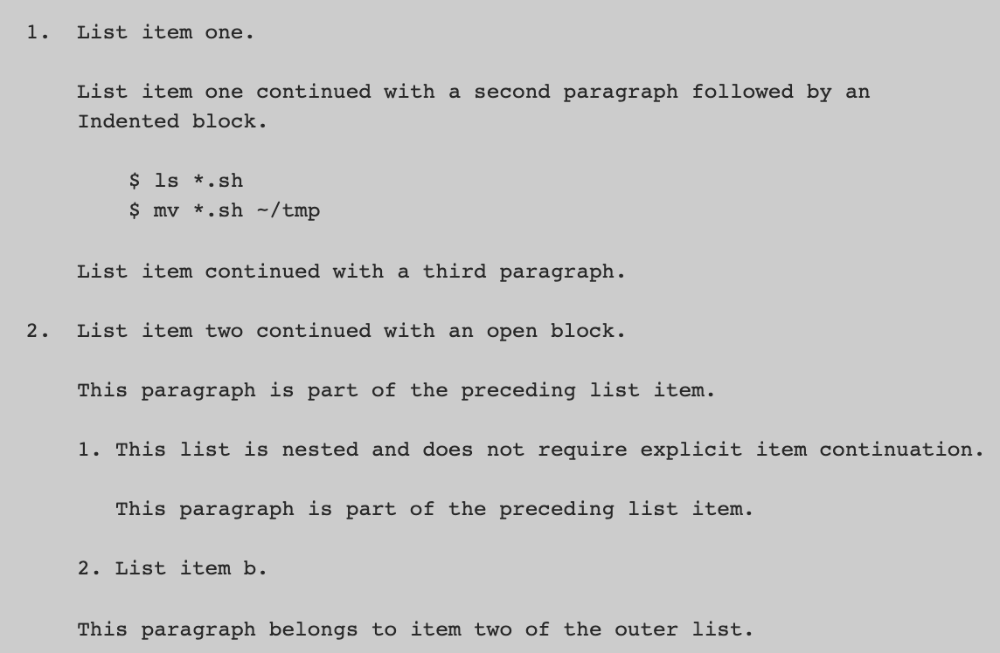
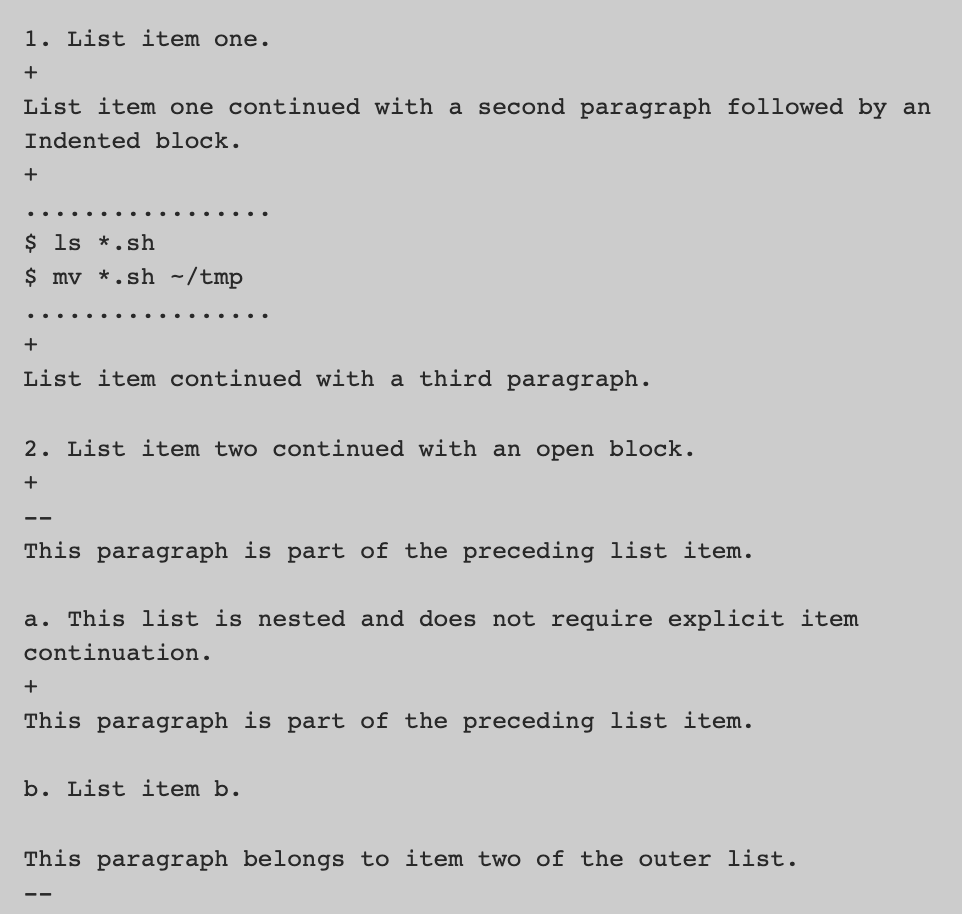
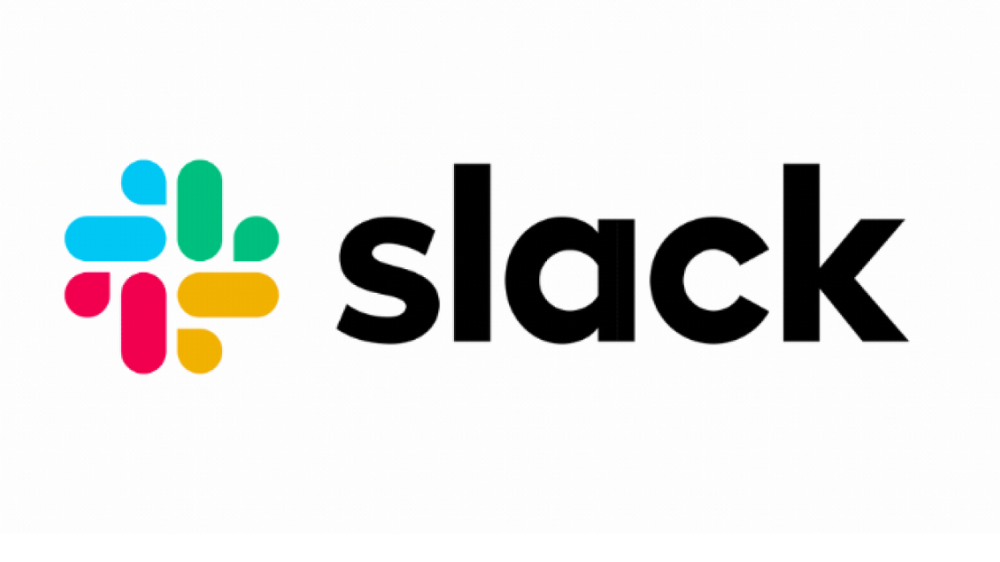
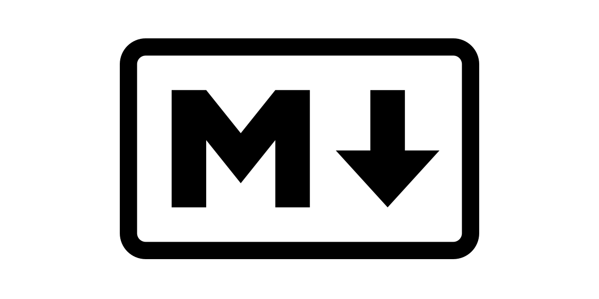
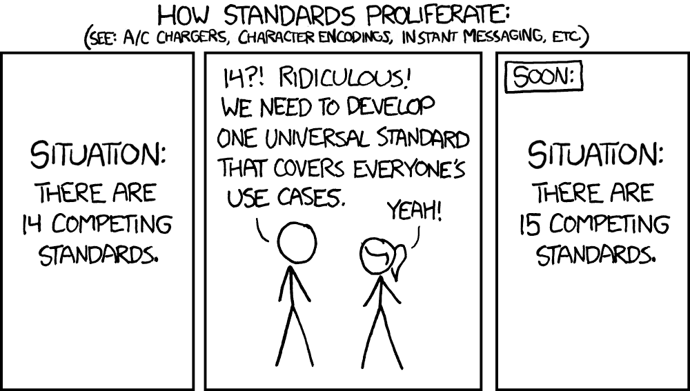

>>>> # **The Lowdown on Markdown**
---

 
 
 
 

 # **what is it?**

 

## `Markup: `

Data in an electronic document **not** typically included in the document's end user representation

Often used to:
  - Control the display of the document
  - Enrich the document's content to facilitates automated processing

 

`examples: HTML, Rich Text Format (rtf)`

  ---
   
   

## `Markdown: `

Created by John Gruber (with much contribution from Aaron Swartz) in 2004.

A *lightweight* markup language used to add formatting elements to plaintext text documents.

Gruber defined the Markdown syntax and wrote a Perl script-- the first *Markdown processor*.

Markdown is available as a free and open source software.

The script can be downloaded directly from [Gruber's website][daringfireball], which also contains Markdown documentation:

[daringfireball]:https://daringfireball.net/projects/markdown/

 
 

# **how it works**

  Markdown applications use a *Markdown processor* (also commonly referred to as a “parser” or an “implementation”).

  Markdown-formatted text is outputted to HTML format. The document can then be viewed in a web browser or combined with a style sheet and printed.

The script converts marked-up text to valid and well-formed XHTML or HTML.

 
 

#### `Markdown Principle | ` key design goal: *readability*

 

>Sample Markdown code:
>
>Publishable as is, but indentation rules make it a bit trickier/finicky to write.

 

>Sample AsciiDoc code:
>
>At the cost of readability, code is a bit more clear to specify sections, and indentation not important.

 
 
 

# **the markdown takeover**

The use of Markdown spread quickly and rapidly.

Used in many applications: blogging, instant messaging, online forums, collaborative software, documentation pages, and readme files, and more.

 

#### `Apps that utilize Markdown:`

Hundreds of millions of people have used Markdown thanks to it's quick and wide-spread use.

> **Reddit, StackOverflow, Notion, Wordpress, Slack, Discord, Microsoft Teams... SO many more**

 

Markdown's original ambiguity led to many  accidental and intentional alterations to the language.

Apps will often create their own *flavor* of markdown. \
Think of it like different markdown dialects.

Below are some examples with links to their respective documentation:

| App | App's Markdown Syntax |
|:-------:|:---------------------:|
|  | [Reddit-flavored Markdown][red] |
|  | [StackOverflow Markdown Help][so] |
|  |  [Notion Markdown Support][no] |
|  | [WordpPress Markdown Blocks][wp] |
|  | [Slack Text Object Formatting][sl] |
|  | [Discord Markdown 101][dis] |

[red]:https://www.reddit.com/wiki/markdown
[so]:https://stackoverflow.com/editing-help
[no]:https://www.markdownguide.org/tools/notion/#:~:text=Notion%20Markdown%20Support,for%20the%20following%20Markdown%20elements.&text=When%20copying%20and%20pasting%20Markdown,Notion%2C%20press%20Shift%2DReturn.
[wp]:https://wordpress.com/support/wordpress-editor/blocks/markdown-block/
[sl]:https://api.slack.com/reference/surfaces/formatting#basics
[dis]:https://support.discord.com/hc/en-us/articles/210298617-Markdown-Text-101-Chat-Formatting-Bold-Italic-Underline-

 

# **standard markdown**

Markdown's inital release syntax was informally defined and ambiguous.

 

 
 

CommonMark was developed by a group of developers including Jeff Atwood, co-founder of Stack Overflow.

They proposed:
- A standard, unambiguous syntax specification
- A suite of comprehensive tests to validate Markdown implementations

Its contributors and supporters include developers from Github and reddit.

 

There are several lightweight markup languages that are supersets of Markdown. They include basic syntax and build upon it by adding additional elements like tables, code blocks, syntax highlighting, URL auto-linking, and footnotes.

 
 
 

# **GitHub and Readmes**

 READMEs are the face of your project repositories

 Make your READMEs look great by using Markdown & HTML!

  

#### GitHub uses its own `GitHub Flavored Markdown`

- Superset specification of CommonMark

 
 
 

# **Sources and Useful Markdown Links**

`Sources and Useful Links: `
- [Markdown Guide][mdguide]
- [CommonMark][cm]
- [Markdown Table Generator][tablegen]
- [Wikipedia Page for Markdown][wiki]
- [GitHub Flavored Markdown][gh]

[mdguide]:https://www.markdownguide.org
[cm]:https://commonmark.org/
[tablegen]:https://www.tablesgenerator.com/markdown_tables
[wiki]:https://en.wikipedia.org/wiki/Markdown
[gh]:https://github.github.com/gfm/
